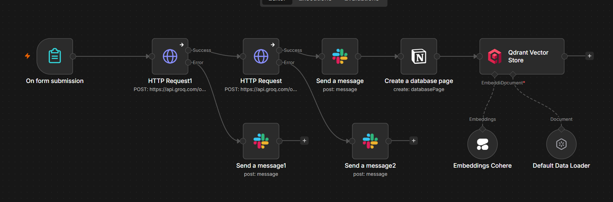
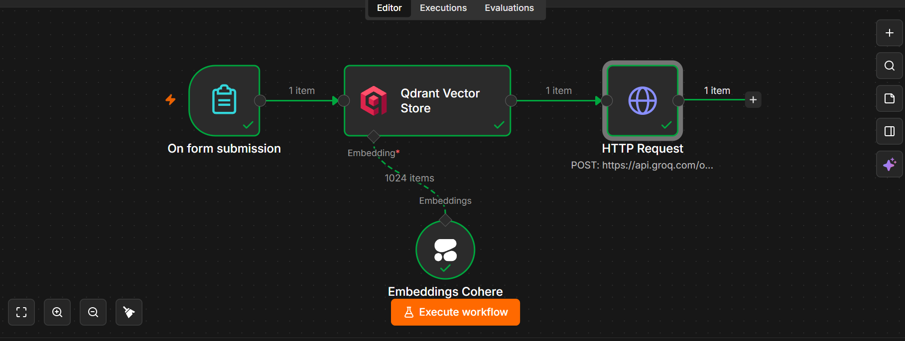
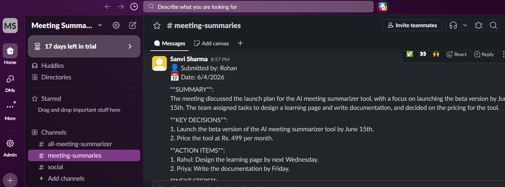
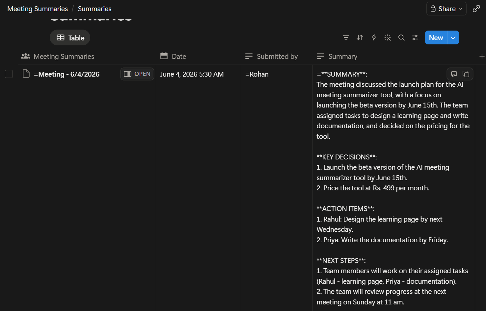

# 🤖 AI Meeting Intelligence System

An end-to-end AI-powered meeting automation system built with **n8n** that transcribes audio recordings, generates structured summaries, delivers them to Slack and Notion, and enables natural language querying across entire meeting history using RAG.

---

## 🎯 What It Does

Upload a meeting recording → get a structured summary with key decisions, action items and next steps delivered to your Slack channel and stored permanently in Notion. Ask questions about any past meeting in plain English and get instant answers.

---

## 🏗️ Architecture

### Workflow 1 — Meeting Summarizer

```
Audio Upload (Form)
        ↓
Groq Whisper  →  Transcribes audio to text
        ↓
LLaMA 3.3     →  Generates structured summary
        ↓
   ┌────┴────┐
Slack      Notion     →  Delivers & stores summary
        ↓
Qdrant Vector Store   →  Embeds & indexes for RAG
```

**Error Handling:** Automated Slack alerts fire on Whisper or LLM failures — ensuring no silent breakdowns in the pipeline.

---

### Workflow 2 — Meeting Query (RAG)

```
Question (Form)
        ↓
Cohere Embeddings  →  Embeds the question
        ↓
Qdrant Search      →  Retrieves relevant meetings
        ↓
LLaMA 3.3          →  Answers from context
```

---

## 📸 Screenshots

### n8n Workflow — Meeting Summarizer


### n8n Workflow — Meeting Query


### Slack Delivery


### Notion Database


---

## ✨ Features

- 🎙️ **Audio transcription** using Groq Whisper (supports .ogg, .mp3, .wav)
- 📋 **Structured summaries** — Summary, Key Decisions, Action Items, Next Steps
- 💬 **Slack delivery** — auto-posted to `#meeting-summaries` channel
- 📝 **Notion storage** — permanent database with date, submitter and full summary
- 🧠 **RAG-powered querying** — ask questions across all past meetings
- ⚠️ **Error handling** — automated Slack alerts for pipeline failures

---

## 🛠️ Tech Stack

| Tool | Purpose |
|---|---|
| **n8n** | Workflow orchestration |
| **Groq Whisper** | Audio transcription |
| **LLaMA 3.3 (Groq)** | Meeting summarization & Q&A |
| **Cohere Embeddings** | Text vectorization (1024-dim) |
| **Qdrant** | Vector database for RAG |
| **Slack API** | Summary delivery |
| **Notion API** | Permanent storage |

---

## 🚀 How To Use

### Setup

1. Clone this repo
2. Install and run n8n locally:
```bash
npm install -g n8n
n8n start
```
3. Import both workflow JSON files into n8n
4. Add your API credentials:
   - Groq API Key
   - Cohere API Key
   - Qdrant Cloud URL + API Key
   - Slack OAuth Token
   - Notion Integration Token

### Running

**To summarize a meeting:**
1. Open the Meeting Summarizer form URL
2. Enter your name and upload audio file
3. Check `#meeting-summaries` on Slack for the summary
4. Check Notion database for permanent record

**To query past meetings:**
1. Open the Meeting Query form URL
2. Type your question in plain English
3. Get an answer based on all past meeting history

---

## 📁 Repository Structure

```
ai-meeting-intelligence-system/
├── README.md
├── meeting_summarizer_workflow.json    ← Import into n8n
└── meeting_query_workflow.json         ← Import into n8n
```

---

## 💡 Key Technical Decisions

**Why Groq over OpenAI?**
Groq provides significantly faster inference with a generous free tier — ideal for real-time meeting processing.

**Why Qdrant over Pinecone?**
Qdrant has native n8n integration and a free cloud tier with no credit card required.

**Why Cohere for embeddings?**
Cohere's `embed-english-v3.0` (1024-dim) provides high quality semantic search with a free trial tier.

**Time-aware RAG:**
The system stores meeting dates as metadata in Qdrant, enabling filtered retrieval — so "when is the next meeting?" returns the most recent answer, not just any semantically similar result.


---

## 👩‍💻 Author

**Sanvi Sharma**
[GitHub](https://github.com/sanvisharma29) | [LinkedIn](https://www.linkedin.com/in/sanvisharma29)
